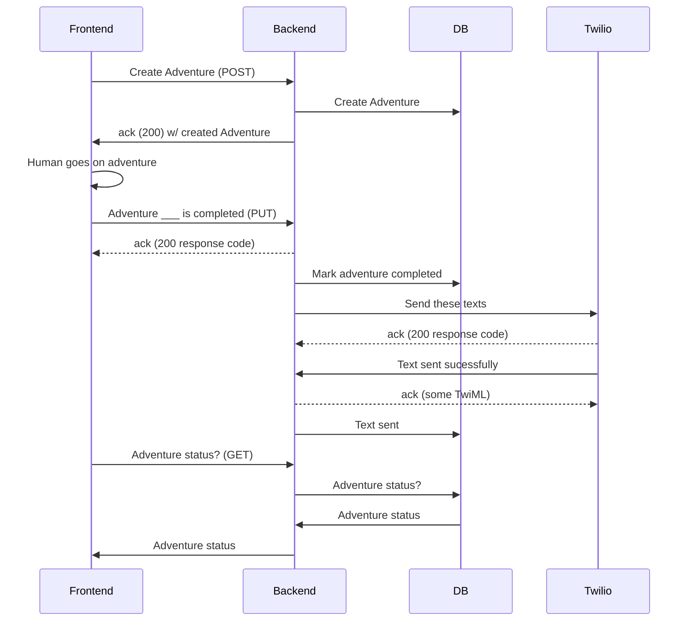

# Readme

## How to run

```bash
docker build . -t reportback
docker run -it -p 8000:8000 reportback
```

The initial build is pretty slow, but incremental code changes should be pretty quick.

You can visit the docs at

```
http://localhost:8000/docs
```

For now, you have to log in to Auth0 as James to get a token. I will fix that.

## Architecture

You may need to get a Mermaid (mmd) renderer to see this rendered into a nice sequece Diagram

### Adventure workflow


Notes:
- Frontend creates the UUID for idempotency
